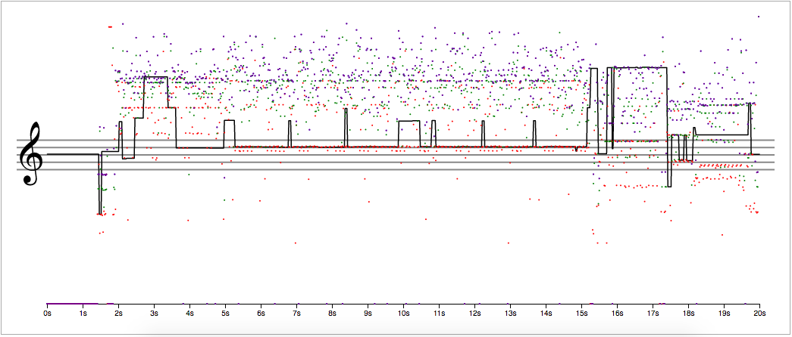

# Spectral Score

Graphing of spectral data from the fiddle object in pd-extended to a music staff-like graph. Part of a project making machine 'transcriptions' of machine 'performances'. The data files here are from the first 20 seconds of Yasunao Tone's _Solo for Wounded CD_, a seminal glitch work using hand altered CD's as a chance method allowing listening to early CD player's error correction software.

